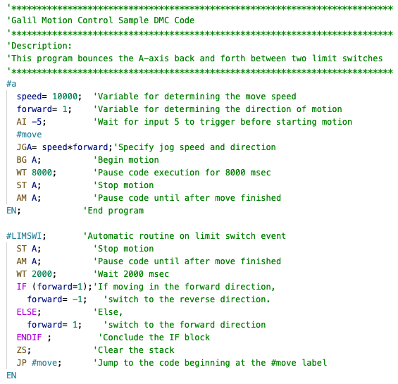

# Galil DMC Highlighting

## Description

Galil DMC Highlighting brings syntax highlight for the Galil DMC Programming Language to VSCode.

Galil DMC Highlighting should work with Visual Studio Code, VSCodium, and any other version of VSCode.

## Installing

The latest stable version of the extensions can be installed directly from the [Visual Studio Marketplace](https://marketplace.visualstudio.com/items?itemName=Kestin.galildmchighlighting) or the [OpenVSX Registry](https://open-vsx.org/extension/kestin/galildmchighlighting).

To install the latest development version you will need to download the .vsix from the latest [GitHub Release](https://github.com/kForth/Galil-DMC-Highlighting-for-VSCode/releases) and [install it manually](https://code.visualstudio.com/docs/editor/extension-gallery#_install-from-a-vsix).

## Preview

